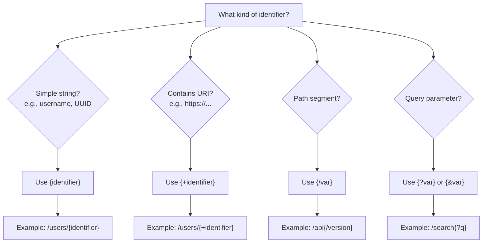

URI Template
============

Fedify uses URI Templates ([RFC 6570]) for defining URL patterns throughout
the framework.  This includes actor dispatchers, collection dispatchers, inbox
listeners, object dispatchers, and more.  Understanding the different expansion
types is crucial for handling identifiers correctly, especially when they
contain special characters or URIs.

[RFC 6570]: https://datatracker.ietf.org/doc/html/rfc6570

What are URI Templates?
-----------------------

URI Templates are a compact way to describe a range of URIs through variable
expansion.  They use curly braces `{}` to mark variable parts that get replaced
with actual values.  The way these variables are expanded depends on the
*operator* used inside the braces.

Expansion types
---------------

### Simple string expansion: `{var}`

Simple expansion is the default behavior when no operator is specified.
It percent-encodes reserved characters, making it suitable for basic string
identifiers like usernames or UUIDs.

Use this for basic identifiers that don't contain URIs or paths, such as
simple usernames (`alice`), numeric IDs, or UUIDs.  Notice how special
characters like `:` and spaces are percent-encoded:

| Template              | Value         | Result                 |
|-----------------------|---------------|------------------------|
| `/users/{identifier}` | `alice`       | `/users/alice`         |
| `/users/{identifier}` | `alice:bob`   | `/users/alice%3Abob`   |
| `/users/{identifier}` | `hello world` | `/users/hello%20world` |

Here's how to use it in an actor dispatcher:

~~~~ typescript twoslash
import { Person, type Federation } from "@fedify/fedify";
const federation = null as unknown as Federation<void>;
// ---cut-before---
federation.setActorDispatcher(
  "/users/{identifier}",  // Simple expansion
  async (ctx, identifier) => {
    // identifier could be: "alice", "user123", "uuid-4567", etc.
    return new Person({
      id: ctx.getActorUri(identifier),
      preferredUsername: identifier,
      // ...
    });
  }
);
~~~~

> [!WARNING]
> Do not use simple expansion for identifiers that contain URIs or paths,
> as it will double-encode reserved characters like `:`, `/`, `?`, etc.

### Reserved string expansion: `{+var}`

Reserved expansion (using the `+` operator) preserves reserved characters that
are allowed in URIs, such as `:`, `/`, `?`, `#`, etc.  This is essential when
your identifier contains a URI or path.

Use this for identifiers that contain URIs, URLs, or paths.  Unlike simple
expansion, reserved characters are kept as-is instead of being percent-encoded.
This prevents double-encoding issues when your identifier is itself a URI:

| Template               | Value                       | Result                             |
|------------------------|-----------------------------|------------------------------------|
| `/users/{+identifier}` | `https://example.com/actor` | `/users/https://example.com/actor` |
| `/users/{+identifier}` | `alice:bob`                 | `/users/alice:bob`                 |
| `/users/{+identifier}` | `path/to/resource`          | `/users/path/to/resource`          |

Here's how to use it when your identifiers might contain URIs:

~~~~ typescript twoslash
import { Person, type Federation } from "@fedify/fedify";
const federation = null as unknown as Federation<void>;
// ---cut-before---
federation.setActorDispatcher(
  "/users/{+identifier}",  // Reserved expansion
  async (ctx, identifier) => {
    // identifier could be: "https://example.com/actor", "urn:uuid:123", etc.
    return new Person({
      id: ctx.getActorUri(identifier),
      preferredUsername: identifier,
      // ...
    });
  }
);
~~~~

> [!TIP]
> If you're getting double-encoding issues (e.g., `%253A` instead of `%3A`),
> switch from `{identifier}` to `{+identifier}`.

### Path segment expansion: `{/var}`

Path expansion automatically prefixes the value with a `/` character.
It's useful for optional path segments.  When the variable is empty or
undefined, nothing is added to the path:

| Template         | Value     | Result    |
|------------------|-----------|-----------|
| `/api{/version}` | `v1`      | `/api/v1` |
| `/api{/version}` | *(empty)* | `/api`    |

### Query parameter expansion: `{?var}`

Query expansion creates URL query parameters with `?` prefix.  You can specify
multiple variables separated by commas, and each will become a separate query
parameter:

| Template           | Value              | Result                    |
|--------------------|--------------------|---------------------------|
| `/search{?q}`      | `hello`            | `/search?q=hello`         |
| `/search{?q,lang}` | `q=hello, lang=en` | `/search?q=hello&lang=en` |

### Query continuation: `{&var}`

Query continuation adds additional query parameters using `&` instead of `?`.
This is useful when you already have query parameters in the template and want
to add more:

| Template               | Value   | Result                     |
|------------------------|---------|----------------------------|
| `/search?type=all{&q}` | `hello` | `/search?type=all&q=hello` |

Common use cases in Fedify
---------------------------

### Actor identifiers

If you're using simple usernames or UUIDs as actor identifiers, use simple
expansion.  This will properly encode any special characters:

~~~~ typescript twoslash
import { Person, type Federation } from "@fedify/fedify";
const federation = null as unknown as Federation<void>;
// ---cut-before---
federation.setActorDispatcher(
  "/users/{identifier}",
  async (ctx, identifier) => {
    // identifier: "alice", "bob", "550e8400-e29b-41d4-a716-446655440000"
    return new Person({
      id: ctx.getActorUri(identifier),
      preferredUsername: identifier,
      // ...
    });
  }
);
~~~~

However, if you're using URIs as identifiers (for example, when building
a proxy layer on top of existing ActivityPub servers), use reserved expansion
to avoid double-encoding:

~~~~ typescript twoslash
import { Person, type Federation } from "@fedify/fedify";
const federation = null as unknown as Federation<void>;
// ---cut-before---
federation.setActorDispatcher(
  "/users/{+identifier}",
  async (ctx, identifier) => {
    // identifier: "https://solid.example/activitypub/actor"
    return new Person({
      id: ctx.getActorUri(identifier),
      preferredUsername: identifier,
      // ...
    });
  }
);
~~~~

### Collections

The same principle applies to collections.  Use simple expansion when your
identifiers are basic strings:

~~~~ typescript twoslash
import { type Federation, type Recipient } from "@fedify/fedify";
const federation = null as unknown as Federation<void>;
// ---cut-before---
federation.setFollowersDispatcher(
  "/users/{identifier}/followers",
  async (ctx, identifier, cursor) => {
    // identifier: "alice", "bob"
    const items: Recipient[] = [];  // Your implementation here
    return { items };
  }
);
~~~~

And use reserved expansion when identifiers might contain URIs:

~~~~ typescript twoslash
import { type Federation, type Recipient } from "@fedify/fedify";
const federation = null as unknown as Federation<void>;
// ---cut-before---
federation.setFollowersDispatcher(
  "/users/{+identifier}/followers",
  async (ctx, identifier, cursor) => {
    // identifier: "https://example.com/users/alice"
    const items: Recipient[] = [];  // Your implementation here
    return { items };
  }
);
~~~~

### Other dispatchers and listeners

URI Templates work the same way across all Fedify routing configurations.
Here are some additional examples:

Inbox listeners use the same pattern as other dispatchers:

~~~~ typescript twoslash
import { type Federation, Create } from "@fedify/fedify";
const federation = null as unknown as Federation<void>;
// ---cut-before---
federation
  .setInboxListeners("/users/{identifier}/inbox", "/inbox")
  .on(Create, async (ctx, create) => {
    // Handle incoming Create activity
  });
~~~~

Object dispatchers allow you to serve ActivityPub objects at custom URIs:

~~~~ typescript twoslash
import { Note, type Federation } from "@fedify/fedify";
const federation = null as unknown as Federation<void>;
// ---cut-before---
federation.setObjectDispatcher(
  Note,
  "/users/{identifier}/posts/{id}",
  async (ctx, values) => {
    // values.identifier and values.id are both available
    return new Note({
      id: ctx.getObjectUri(Note, values),
      content: "Hello, world!",
    });
  }
);
~~~~

The same expansion rules apply: use `{identifier}` for simple strings and
`{+identifier}` for URI-containing values.

Common pitfalls
---------------

### Double-encoding with `{identifier}` for URIs

Using `{identifier}` when the identifier contains a URI causes double-encoding.
For example, if your identifier is `"https://example.com/actor"`, the collection
ID becomes `https://fedify.example/users/https%253A%252F%252Fexample.com%252Factor/followers`
(notice `%253A` instead of `%3A`—the percent sign itself gets encoded).

This is wrong:

~~~~ typescript
// ❌ WRONG: Using {identifier} for URI-containing identifiers
federation.setFollowersDispatcher(
  "/users/{identifier}/followers",
  async (ctx, identifier, cursor) => {
    // Double-encoding will occur!
  }
);
~~~~

Instead, use `{+identifier}` for URI-containing identifiers:

~~~~ typescript
// ✅ CORRECT: Using {+identifier} for URI-containing identifiers
federation.setFollowersDispatcher(
  "/users/{+identifier}/followers",
  async (ctx, identifier, cursor) => {
    // Now it expands to: /users/https://example.com/actor/followers
  }
);
~~~~

### Matching issues with `{+identifier}`

Reserved expansion `{+identifier}` can match too broadly, including additional
path segments.  For example, `/users/{+identifier}` might match
`/users/alice/inbox`, giving `identifier` the value `"alice/inbox"`.

To prevent this, add validation in your dispatcher to reject identifiers
containing unexpected characters:

~~~~ typescript twoslash
import { Person, type Federation } from "@fedify/fedify";
const federation = null as unknown as Federation<void>;
// ---cut-before---
federation.setActorDispatcher(
  "/users/{+identifier}",
  async (ctx, identifier) => {
    // Reject identifiers with path separators if not expected
    if (identifier.includes('/')) return null;
    return new Person({
      id: ctx.getActorUri(identifier),
      preferredUsername: identifier,
    });
  }
);
~~~~

Decision guide
--------------

Use this guide to choose the right expansion type:

Quick reference:

| If your identifier contains…  | Use                         |
|--------------------------------|-----------------------------|
| Just letters, numbers, hyphens | `{identifier}`              |
| UUIDs                          | `{identifier}`              |
| URIs or URLs                   | `{+identifier}`             |
| Special chars like `:`, `/`    | `{+identifier}`             |
| Path segments                  | `{+identifier}` or `{/var}` |

Troubleshooting
---------------

### How do I know if I'm using the wrong expansion type?

Symptoms of using `{identifier}` when you should use `{+identifier}`:

- Double-encoded characters (e.g., `%253A` instead of `%3A`)
- Collection IDs that don't match the expected format
- Errors when trying to access generated URIs

Symptoms of using `{+identifier}` when you should use `{identifier}`:

- Routes matching too broadly (catching extra path segments)
- Security issues with path traversal
- Unexpected values in your identifier parameter

### Testing your URI Template

You can test your URI Template patterns by examining the generated URIs in your
dispatcher callbacks.  The `Context.getActorUri()` and similar methods will
expand the templates according to the pattern you specified.

For example, to verify the expansion:

~~~~ typescript twoslash
import { Person, type Federation } from "@fedify/fedify";
const federation = null as unknown as Federation<void>;
// ---cut-before---
federation.setActorDispatcher(
  "/users/{+identifier}",
  async (ctx, identifier) => {
    // Log the generated URI to verify expansion
    const uri = ctx.getActorUri(identifier);
    console.log(`Identifier: ${identifier}`);
    console.log(`Generated URI: ${uri.href}`);

    return new Person({
      id: uri,
      preferredUsername: identifier,
    });
  }
);
~~~~

Further reading
---------------

[RFC 6570]: URI Template
:   The official specification

[Actor dispatcher](./actor.md)
:   Learn about actor routing in Fedify

[Collections](./collections.md)
:   Learn about collection routing in Fedify

[Inbox listeners](./inbox.md)
:   Learn about handling incoming activities

[Object dispatcher](./object.md)
:   Learn about serving custom objects
